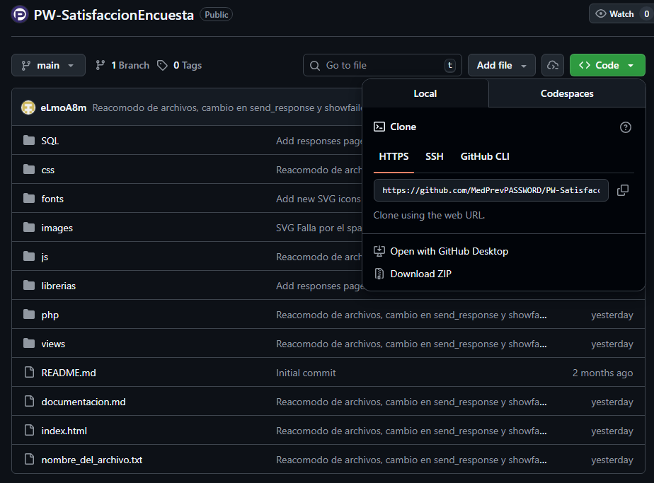
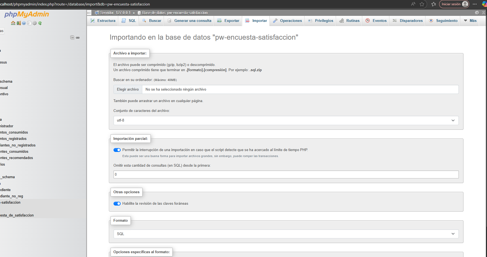
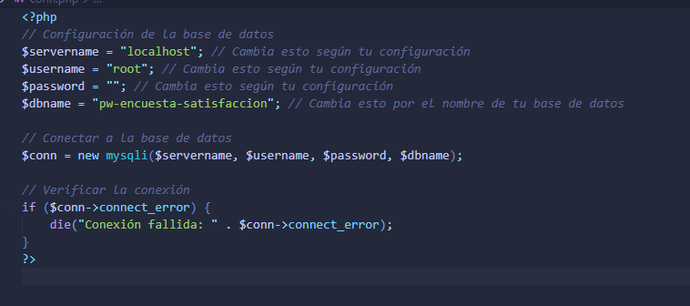
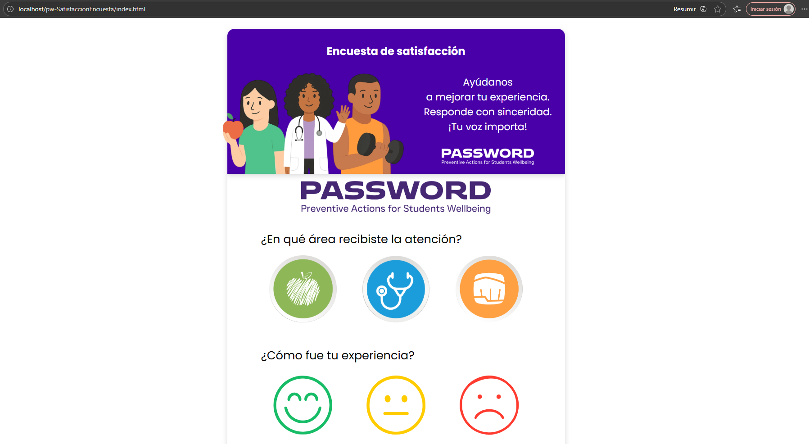
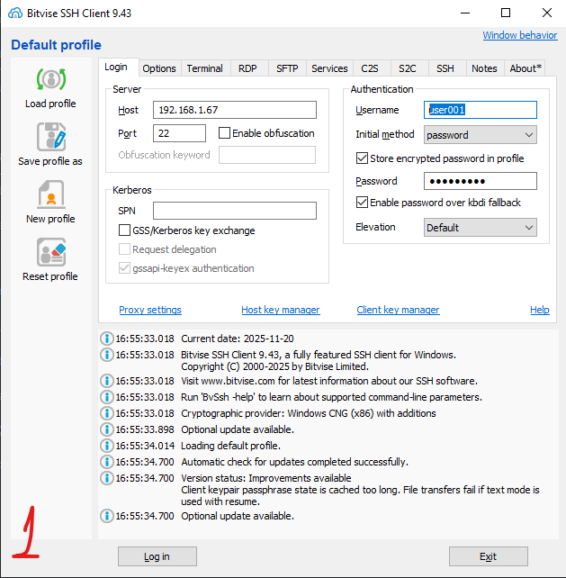
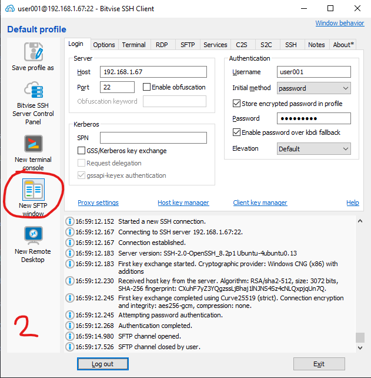
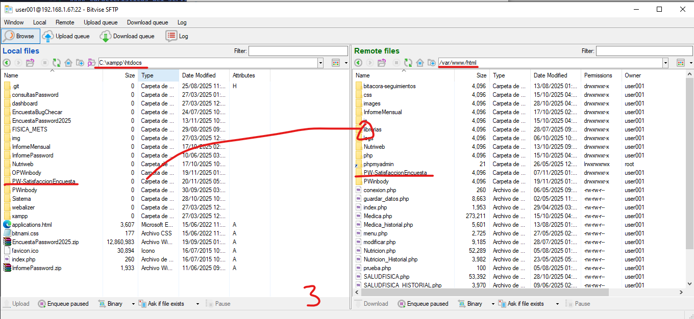
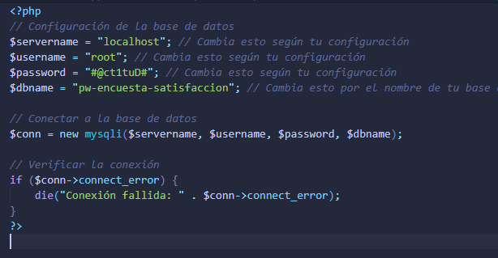
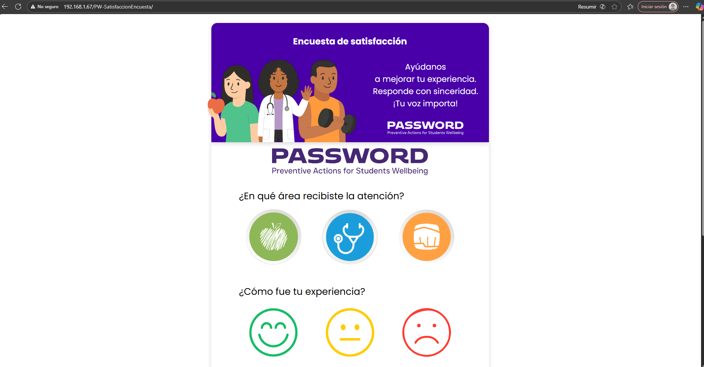
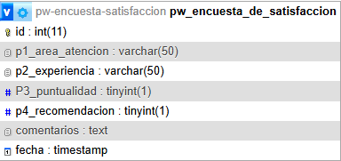

# Sistema de Encuestas de Satisfacción - Facultad de Medicina
## 📋 Tabla de Contenidos
- [Descripción General](#descripción-general)
- [Objetivo del Proyecto](#-objetivo-del-proyecto)
- [Encuesta de Satisfacción](#encuesta-de-satisfacción)
- [Flujo General del Sistema](#flujo-general-del-sistema)
- [Tecnologías Utilizadas](#tecnologías-utilizadas)
- [Estructura del Sistema](#estructura-del-sistema)
- [Instalación](#-instalación)
- [Configuración para Producción](#configuración-para-producción)
- [Arquitectura Técnica](#arquitectura-técnica)
- [Base de Datos](#base-de-datos)
- [API y Endpoints](#api-y-endpoints)
- [Lógica Frontend](#lógica-frontend)

## 🏥 Descripción General
Este sistema forma parte del Módulo de Atención a Estudiantes PASSWORD de la Facultad de Medicina, dentro del área de Medicina Preventiva.

El proyecto consiste en una encuesta de satisfacción que los estudiantes contestan al finalizar su consulta en alguna de las tres áreas:
- Área Física
- Área Médica  
- Área Nutricional

Al finalizar su consulta, cada estudiante responde una encuesta de satisfacción, la cual mide la calidad del servicio recibido y la percepción general de la atención.

Las respuestas se registran en una base de datos centralizada y pueden ser consultadas posteriormente desde un panel administrativo por los responsables de cada área.

## 🎯 Objetivo del Proyecto

- Obtener retroalimentación directa sobre la atención brindada
- Evaluar desempeño y nivel de satisfacción del estudiante
- Facilitar estadísticas por área y experiencia
- Proveer datos para toma de decisiones y mejora continua

## Encuesta de Satisfacción

### Pregunta 1
**¿En qué área recibiste la atención?**
- Opciones: Nutrición, Medicina, Física
- Campo: p1-area_atencion

### Pregunta 2
**¿Cómo fue tu experiencia?**
- Opciones: satisfecho / normal / insatisfecho
- Campo: p2-experiencia

### Pregunta 3
**¿Tu atención se dio a tiempo?**
- Opciones: Sí (1), No (0)
- Campo: p3-puntualidad

### Pregunta 4
**¿Nos recomendarías con tus compañeros?**
- Opciones: Sí (1), No (0)
- Campo: p4-recomendacion

### Pregunta 5
**Comentario o sugerencia**
- Campo: p5-comentarios


## Flujo General del Sistema

1. El estudiante llega a su consulta en alguna de las áreas
2. Al finalizar, se le presenta un formulario digital (encuesta)
3. El estudiante responde:
    - Área donde recibió atención
    - Experiencia general
    - Puntualidad
    - Recomendación
    - Comentarios opcionales
4. El frontend envía las respuestas mediante una petición fetch() a send_response.php
5. Los datos se guardan en la base de datos
6. Los titulares pueden entrar a views/responses.html para:
    - Ver respuestas
    - Filtrar por área o experiencia
    - Exportar o analizar información desde DataTables
7. La página obtiene los datos mediante get_responses.php

## Tecnologías Utilizadas

| Componente | Tecnología |
|-----------|------------|
| Frontend | HTML, CSS, JavaScript |
| Backend | PHP (procedimental) |
| Base de Datos | MySQL |
| Librerías | DataTables |
| Otros | Fetch API, JSON |

## Estructura del Sistema

```
C:.
│   index.html
│   README.md
│   nombre_del_archivo.txt
│
├── css/
│   ├── admin.css
│   ├── fonts.css
│   └── style.css
│
├── fonts/
│   └── (tipografías Poppins…)
│
├── images/
│   └── iconos, imágenes SVG, imágenes de áreas
│
├── js/
│   ├── main.js
│   ├── alerts.js
│   └── responses.js
│
├── librerias/
│   ├── datatables.css
│   ├── datatables.js
│   └── datatables.min.js
│
├── php/
│   ├── conn.php
│   ├── get_responses.php
│   └── send_response.php
│
├── SQL/
│   └── pw_encuesta_de_satisfaccion.sql
│
└── views/
     └── responses.html
```

## 🚀 Instalación

### Prerrequisitos Técnicos

| Componente | Versión Mínima | Recomendada |
|------------|----------------|-------------|
| PHP | 7.0+ | 7.4+ |
| MySQL | 5.7+ | 8.0+ |
| Servidor Web | Apache | Apache|
| Navegador | Chrome  | Edge  |

### 📥 Pasos de Instalación Local

**Recomendamos usar VS Code como editor y XAMPP como servidor local**

1. Clonar o descargar el repositorio en el servidor web

https://github.com/MedPrevPASSWORD/PW-SatisfaccionEncuesta



2. Importar el archivo SQL `SQL/pw_encuesta_de_satisfaccion.sql` en la base de datos MySQL



3. Configurar las credenciales de la base de datos en `php/conn.php`



4. Asegurarse de que el servidor web tenga permisos para ejecutar archivos PHP

5. Acceder a `index.html` desde el navegador para ver el formulario de la encuesta



## Configuración para Producción

### Acerca del Servidor

El sistema puede ser desplegado en cualquier servidor web que soporte PHP y MySQL. Para este proyecto, se recomienda utilizar el **servidor SARA** de la Facultad de Medicina.

#### Características del Servidor SARA
- **Sistema Operativo:** Linux - Ubuntu server 20.04 LTS
- **Servidor Web:** Apache
- **Base de Datos:** MySQL (preinstalado y configurado)
- **Estado:** Listo para producción
- **Acceso Remoto:** A través de Bitvise SSH Client
- **Ubicación Física:** Facultad de Medicina, Medicina Preventiva, modulo password, sala de contacto.
- **Ip de acceso:** 192.168.1.67

#### Credenciales de Acceso

| Servicio | Usuario | Contraseña |
|----------|---------|------------|
| phpMyAdmin (root) | `user001` | `#@ct1tuD#` |

> **📋 Nota:** Para detalles específicos sobre configuración y administración del servidor SARA, consultar la documentación interna del Ing. Carlos Ramírez.


### Pasos para Despliegue en Producción

1. Subir todos los archivos al servidor web mediante Bitvise o similar





2. Arrastrar los archivos al directorio raíz del servidor web (normalmente `/var/www/html/`)



3. Configurar las credenciales de la base de datos en `php/conn.php` acorde al entorno de producción



4. Importar el archivo SQL `SQL/pw_encuesta_de_satisfaccion.sql` en la base de datos MySQL del servidor de producción (exactamente igual que el paso 2 de instalación local)

5. Probar el formulario en producción y verificar que las respuestas se guarden correctamente




## Arquitectura Técnica

### Frontend

- Formulario HTML interactivo con validación en tiempo real
- Comunicación asíncrona mediante Fetch API
- Feedback visual mediante alertas y modales
- Tablas dinámicas con DataTables para administración

### Backend (PHP)
- send_response.php recibe y almacena información
- get_responses.php recupera resultados con filtros dinámicos

### Base de datos (MySQL)
- Tabla pw_encuesta_de_satisfaccion
- Campos: área, experiencia, puntualidad, recomendación, comentarios, fecha

## Base de Datos

### Tabla: pw_encuesta_de_satisfaccion

| Campo | Tipo | Descripción |
|-------|------|-------------|
| id | INT (PK, AI) | Identificador |
| p1_area_atencion | VARCHAR(50) | Nutrición / Medicina / Física |
| p2_experiencia | VARCHAR(50) | experiencia |
| p3_puntualidad | TINYINT | 1=Sí, 0=No |
| p4_recomendacion | TINYINT | 1=Sí, 0=No |
| comentarios | TEXT | Opcional |
| fecha | TIMESTAMP | Se genera automáticamente |



## API Y ENDPOINTS

### POST send_response.php

**Función:** Guarda una respuesta nueva de la encuesta.

**Entrada (JSON):**
```json
{
  "area_atencion": "nutricion",
  "experiencia": "satisfecho",
  "puntualidad": 1,
  "recomendacion": 1,
  "comentarios": "Muy buena atención"
}
```

**Salida (JSON):**
```json
{
  "success": true,
  "message": "Encuesta enviada con éxito"
}
```

**Acciones principales:**
- Recibe JSON desde fetch
- Valida datos requeridos
- Previene inyecciones SQL usando real_escape_string
- Inserta en MySQL
- Devuelve respuesta JSON al frontend

### GET get_responses.php

**Función:** Obtiene todas las respuestas o aplica filtros (área, experiencia).

**Parámetros opcionales:**
```
?area=medicina  
?experiencia=satisfecho  
```

**Ejemplo:**
```
get_responses.php?area=fisica&experiencia=normal // Aún no se implementa el experiencia por el volumen de datos, pero el codigo está listo para ello. Solo es añadir la logica necesaria en el html y js.
```

**Salida:**
```json
{
  "success": true,
  "count": 34,
  "data": [ ... ],
  "message": "Datos filtrados por: area=fisica, experiencia=normal"
}
```

**Características:**
- Construcción de filtros dinámicos
- Prepared Statements
- Ordenado por fecha DESC
- Retorno en formato JSON

## Lógica Frontend

### main.js
Encargado de:
- Ocultar alertas al cargar la página
- Validar formulario
- Enviar los datos a send_response.php
- Mostrar modal de éxito temporal
- Controlar comportamiento visual de iconos (toggle)
- Confirmar selección de cada pregunta antes de enviar

### responses.js
Encargado de:
- Consumir get_responses.php
- Mostrar resultados en una tabla DataTable
- Filtrar datos por área

### alerts.js
Encargado de:
- Diseñar las funciones para mostrar alertas personalizadas
- Función showSuccessAlert() para mostrar alerta de éxito
- Función showFailedAlert(message) para mostrar alerta de error con mensaje dinámico

## 🔧 Mantenimiento y Soporte

### Monitoreo
- Verificar diariamente que haya respuestas nuevas en la base de datos, usando el panel administrativo
- Revisar logs de errores de PHP y MySQL
- Monitorear el rendimiento de las consultas, al haber potencialmente muchos registros, optimizar índices si es necesario. 
  De momento no es necesario, pero es recomendable tenerlo en cuenta para el futuro.

### Backups
- Backup automático de la base de datos (Lo realiza SARA diariamente y se guardan en google drive de medicina preventiva, la carpeta se llama respaldos)
- Backup manual antes de actualizaciones (Realizarlo antes de cualquier cambio mayor)
- Para restaurar la base de datos, usar phpMyAdmin o línea de comandos MySQL, importando el archivo SQL correspondiente. Se recomienda probar en un entorno de desarrollo antes de restaurar en producción.

### Troubleshooting
- Error común: Conexión a BD fallida → Verificar credenciales en conn.php sobretodo al cambiar de entorno de local a producción.
- Error: Permisos insuficientes → Verificar permisos de escritura en servidor, el servidor web debe tener permisos para ejecutar archivos PHP y escribir en la base de datos. SARA ya tiene estos permisos configurados.
- Error: DataTables no carga → Verificar rutas de librerías, asegurarse de que los archivos JS y CSS de DataTables estén correctamente referenciados en responses.html.
- Error: Respuestas no se guardan → Verificar consola del navegador para errores JS, y logs de PHP para errores en send_response.php.